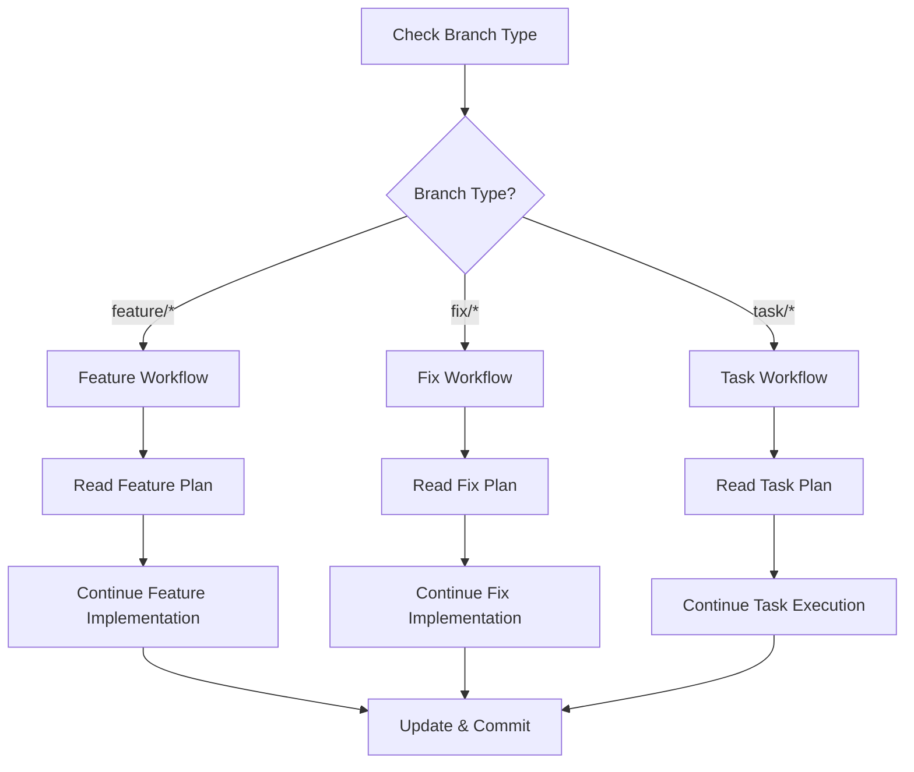

# Continue - Resume Work on Current Branch

Analyzes the current branch context and continues work from where it was left off using the appropriate planning document.

## Workflow

### 1. Analyze Current Branch

Determine what type of work is in progress:

```bash
# Get current branch name
git branch --show-current

# Check recent commits to understand progress
git log --oneline -5

# See what files have been modified
git status
```

Based on branch type, locate planning document:
- **Feature branches** (`feature/*`) → `notes/features/<feature_name>.md`
- **Fix branches** (`fix/*`) → `notes/fixes/<fix_name>.md`
- **Task branches** (`task/*`) → `notes/tasks/<task_name>.md`

### 2. Read Planning Document

Analyze the existing planning document:

```bash
# Find the planning document
ls -la notes/features/ 2>/dev/null
ls -la notes/fixes/ 2>/dev/null
ls -la notes/tasks/ 2>/dev/null

# Read the relevant document
cat notes/[type]/[name].md
```

Understand from the document:
- Overall goal and context
- What has been completed (✅ marked items)
- Current implementation status
- Next steps to take
- Any blockers or issues noted

### 3. Consult Appropriate Agents

Based on work type, consult the relevant planning agent:

#### For Features
- Review guidance from `feature-planner`
- Check implementation plan structure
- Verify test requirements
- Ensure architectural decisions are followed

#### For Fixes
- Review guidance from `fix-planner`
- Check root cause analysis
- Verify regression test requirements
- Review rollback plan if needed

#### For Tasks
- Review guidance from `task-planner`
- Check todo list progress
- Verify success criteria
- Consider if escalation needed

### 4. Research Unfamiliar Concepts

If encountering unknown technologies or patterns:

Invoke `research-agent` to:
- Research unfamiliar APIs or frameworks
- Find documentation for libraries
- Understand best practices
- Get implementation examples

Document findings:
```markdown
## Research Notes
- Technology: [What was researched]
- Key findings: [Important discoveries]
- Implementation approach: [How to apply]
- Sources: [Documentation links]
```

### 5. Continue Implementation

Resume work following the plan:

#### Check Current Status

```markdown
## Current Implementation Status

### Completed ✅
- [List completed steps from plan]

### In Progress 🚧
- [Current work being done]

### Next Steps 📋
- [Immediate next actions]
```

#### Execute Next Step

1. **Read next uncompleted step** from planning document
2. **Implement the functionality** as specified
3. **Create/update tests** for the implementation
4. **Verify step works** correctly
5. **Update planning document** with progress

#### Use Consistency Reviewer

Invoke `consistency-reviewer` to ensure:
- Code follows existing patterns
- Naming conventions are maintained
- File organization matches project structure
- Style consistency is preserved

### 6. Update Planning Document

After completing work:

```markdown
## Implementation Plan

### Step [N]: [Step Name]
- [x] Status: ✅ Completed
- Implementation: [Brief summary]
- Tests: [Test coverage added]
- Notes: [Any important findings]
- Completed: [timestamp]

## Current Status

### What Works
- [Updated list of working features]

### What's Next
- [Next step to tackle]

### How to Test
```bash
# Commands to verify current implementation
mix test test/specific_test.exs
```
```

### 7. Commit Progress

Make focused commits without AI references:

```bash
# Stage relevant files
git add [files]

# Commit with descriptive message
git commit -m "feat: [description of progress made]"

# Update planning document
git add notes/[type]/[name].md
git commit -m "docs: update planning document with progress"
```

## Decision Flow



## Success Criteria

- [ ] Current branch context identified
- [ ] Planning document located and read
- [ ] Progress status understood
- [ ] Next steps identified
- [ ] Unfamiliar concepts researched if needed
- [ ] Implementation continued following plan
- [ ] Consistency with codebase maintained
- [ ] Planning document updated
- [ ] Progress committed properly

## Error Handling

### No Planning Document

```markdown
❌ No planning document found for branch: [branch-name]

Creating planning document based on branch type:
- For features: Invoke feature-planner
- For fixes: Invoke fix-planner
- For tasks: Invoke task-planner
```

### Unclear Next Steps

```markdown
⚠️ Planning document lacks clear next steps

Actions:
1. Review completed work
2. Identify remaining requirements
3. Update planning document with clear steps
4. Continue with first new step
```

### Work Type Unknown

```markdown
⚠️ Cannot determine work type from branch name

Please specify:
- Is this a feature, fix, or task?
- What planning document should be used?
- Or create new plan with appropriate command
```

## Notes

- This command enables seamless work continuation across sessions
- Maintains context through planning documents
- Ensures consistent progress tracking
- Prevents loss of work context
- Enables smooth handoffs between sessions
