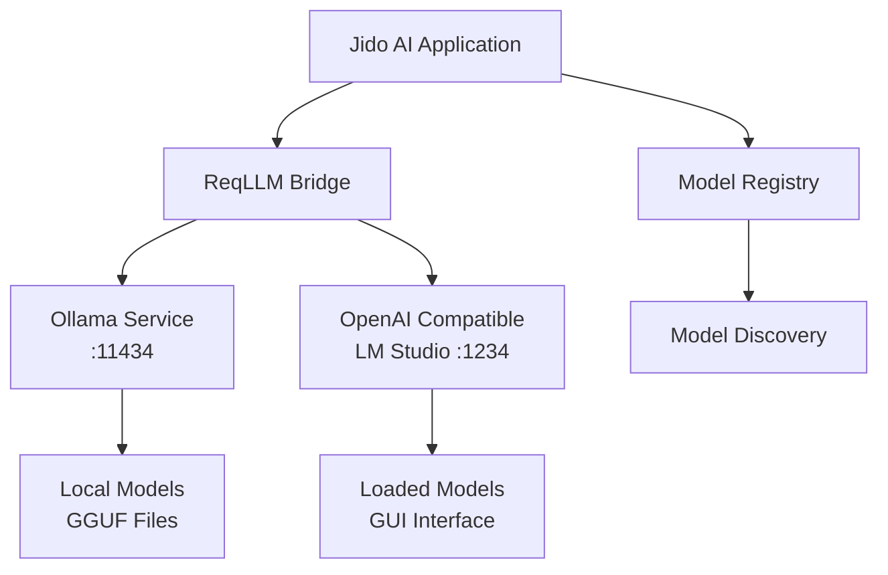

# Local and Self-Hosted AI Provider Usage Guide

A comprehensive guide for deploying and using local AI providers (Ollama, LM Studio) with the Jido AI platform for privacy-conscious and cost-effective AI applications.

## Table of Contents

1. [Overview](#overview)
2. [Ollama Integration](#ollama-integration)
3. [LM Studio Integration](#lm-studio-integration)
4. [Model Discovery and Management](#model-discovery-and-management)
5. [Performance Optimization](#performance-optimization)
6. [Error Handling and Troubleshooting](#error-handling-and-troubleshooting)
7. [Security Considerations](#security-considerations)
8. [Best Practices](#best-practices)
9. [Advanced Patterns](#advanced-patterns)
10. [Migration Guide](#migration-guide)

## Overview

Local AI providers enable privacy-conscious deployments by keeping data and processing entirely on your own infrastructure. This guide covers two primary local provider solutions:

- **Ollama**: Command-line focused local AI runtime with extensive model library
- **LM Studio**: Desktop GUI application with OpenAI-compatible API

### Key Benefits

- **Privacy**: All data stays on your local machine
- **Cost Control**: No per-token charges or usage limits
- **Offline Operation**: Works without internet connectivity
- **Customization**: Full control over models and configurations
- **Performance**: Direct hardware access without network latency

### Architecture



## Ollama Integration

### Installation and Setup

#### Installing Ollama

```bash
# macOS
brew install ollama

# Linux
curl -fsSL https://ollama.ai/install.sh | sh

# Windows
# Download from https://ollama.ai/download
```

#### Starting Ollama Service

```bash
# Start Ollama daemon
ollama serve

# Alternative: run as background service
systemctl start ollama  # Linux
brew services start ollama  # macOS
```

#### Verifying Installation

```bash
# Check Ollama status
ollama list

# Test with a simple model
ollama run llama2:7b
```

### Basic Usage

#### Simple Model Creation

```elixir
# Create an Ollama model instance
{:ok, model} = Jido.AI.Model.from({:ollama, [
  model: "llama2:7b"
]})

# The model is now ready for use
IO.inspect(model)
# => %Jido.AI.Model{
#      provider: :ollama,
#      model: "llama2:7b",
#      reqllm_id: "ollama:llama2:7b"
#    }
```

#### Model with Configuration

```elixir
# Create model with custom parameters
{:ok, model} = Jido.AI.Model.from({:ollama, [
  model: "mistral:7b",
  temperature: 0.7,
  max_tokens: 2048,
  context_length: 4096
]})
```

#### Discovering Available Models

```elixir
# List all available Ollama models
case Jido.AI.Model.Registry.list_models(:ollama) do
  {:ok, models} ->
    IO.puts("Available Ollama models:")
    Enum.each(models, fn model ->
      name = Map.get(model, :name, "Unknown")
      size = Map.get(model, :size, "Unknown size")
      IO.puts("  #{name} (#{size})")
    end)

  {:error, reason} ->
    IO.puts("Ollama service not available: #{inspect(reason)}")
end
```

### Advanced Ollama Configuration

#### Custom Model Parameters

```elixir
# High-precision configuration
{:ok, precise_model} = Jido.AI.Model.from({:ollama, [
  model: "codellama:13b",
  temperature: 0.1,        # Low for consistent code generation
  top_p: 0.9,
  top_k: 10,
  repeat_penalty: 1.1,
  num_ctx: 8192           # Large context for complex code
]})

# Creative writing configuration
{:ok, creative_model} = Jido.AI.Model.from({:ollama, [
  model: "llama2:70b",
  temperature: 0.9,        # High for creativity
  top_p: 0.95,
  repeat_penalty: 1.0,
  num_ctx: 4096
]})
```

#### Model Management Functions

```elixir
defmodule MyApp.OllamaManager do
  @moduledoc "Utilities for managing Ollama models"

  def ensure_model_available(model_name) do
    case Jido.AI.Model.from({:ollama, [model: model_name]}) do
      {:ok, model} ->
        {:ok, model}

      {:error, reason} when is_binary(reason) ->
        if String.contains?(reason, "not found") do
          pull_model(model_name)
        else
          {:error, reason}
        end
    end
  end

  defp pull_model(model_name) do
    # In a real application, you might use System.cmd to pull models
    # System.cmd("ollama", ["pull", model_name])
    {:error, "Model #{model_name} not available"}
  end

  def get_model_info(model_name) do
    with {:ok, models} <- Jido.AI.Model.Registry.list_models(:ollama),
         model when not is_nil(model) <- Enum.find(models, &(Map.get(&1, :name) == model_name)) do
      {:ok, model}
    else
      nil -> {:error, "Model not found"}
      error -> error
    end
  end

  def list_models_by_size(max_size_gb \\ 10) do
    case Jido.AI.Model.Registry.list_models(:ollama) do
      {:ok, models} ->
        filtered_models = Enum.filter(models, fn model ->
          case parse_model_size(Map.get(model, :size, "")) do
            {:ok, size_gb} -> size_gb <= max_size_gb
            _ -> false
          end
        end)

        {:ok, filtered_models}

      error -> error
    end
  end

  defp parse_model_size(size_string) when is_binary(size_string) do
    # Parse sizes like "3.8GB", "1.4 GB", etc.
    case Regex.run(~r/(\d+\.?\d*)\s*GB/i, size_string) do
      [_, size_str] ->
        case Float.parse(size_str) do
          {size, _} -> {:ok, size}
          _ -> {:error, :invalid_size}
        end
      _ -> {:error, :unparseable}
    end
  end
  defp parse_model_size(_), do: {:error, :invalid_format}
end
```

### Popular Ollama Models

#### General Purpose Models

```elixir
# Llama 2 variants
models = [
  "llama2:7b",      # Balanced performance and resource usage
  "llama2:13b",     # Better quality, more resource intensive
  "llama2:70b",     # Highest quality, requires significant resources

  # Code-focused models
  "codellama:7b",   # Code generation and understanding
  "codellama:13b",  # Better code comprehension
  "codellama:34b",  # Production-grade code assistance

  # Instruction-following models
  "mistral:7b",     # Efficient instruction following
  "mixtral:8x7b",   # Mixture of experts model
  "neural-chat:7b", # Conversational AI

  # Specialized models
  "llava:7b",       # Vision-language model
  "dolphin-mixtral:8x7b", # Uncensored variant
  "openhermes:7b"   # Strong reasoning capabilities
]

# Create models dynamically
Enum.each(models, fn model_name ->
  case Jido.AI.Model.from({:ollama, [model: model_name]}) do
    {:ok, model} ->
      IO.puts("✅ #{model_name} configured")
    {:error, reason} ->
      IO.puts("❌ #{model_name} failed: #{inspect(reason)}")
  end
end)
```

## LM Studio Integration

### Installation and Setup

#### Installing LM Studio

1. Download LM Studio from [https://lmstudio.ai/](https://lmstudio.ai/)
2. Install the desktop application
3. Launch LM Studio
4. Download models through the GUI interface

#### Starting Local Server

1. Open LM Studio
2. Go to "Local Server" tab
3. Load a model (e.g., Llama 2 7B)
4. Start the server (usually on port 1234)
5. Verify server is running at `http://localhost:1234/v1`

### Basic Usage

#### OpenAI-Compatible Configuration

```elixir
# Basic LM Studio configuration
{:ok, model} = Jido.AI.Model.from({:openai, [
  model: "local-model",  # Use any name, LM Studio will use loaded model
  base_url: "http://localhost:1234/v1",
  api_key: "not-required"  # LM Studio doesn't require authentication
]})
```

#### Alternative Port Configuration

```elixir
# If LM Studio is running on a different port
{:ok, model} = Jido.AI.Model.from({:openai, [
  model: "my-custom-model",
  base_url: "http://localhost:1235/v1",
  api_key: "lm-studio-local"
]})
```

#### Discovery and Health Checks

```elixir
defmodule MyApp.LMStudioManager do
  @moduledoc "Utilities for managing LM Studio integration"

  @default_ports [1234, 1235, 1236]
  @base_endpoints Enum.map(@default_ports, &"http://localhost:#{&1}/v1")

  def discover_lm_studio_endpoint do
    Enum.find_value(@base_endpoints, fn endpoint ->
      case test_endpoint(endpoint) do
        :ok -> {:ok, endpoint}
        :error -> nil
      end
    end) || {:error, :no_lm_studio_found}
  end

  defp test_endpoint(endpoint) do
    config = {:openai, [
      model: "health-check",
      base_url: endpoint,
      api_key: "test"
    ]}

    case Jido.AI.Model.from(config) do
      {:ok, _model} -> :ok
      {:error, _} -> :error
    end
  end

  def create_lm_studio_model(model_name \\ "loaded-model") do
    case discover_lm_studio_endpoint() do
      {:ok, endpoint} ->
        Jido.AI.Model.from({:openai, [
          model: model_name,
          base_url: endpoint,
          api_key: "lm-studio"
        ]})

      {:error, reason} ->
        {:error, "LM Studio not available: #{inspect(reason)}"}
    end
  end

  def get_lm_studio_models do
    # LM Studio models are managed through the GUI
    # This function provides a way to document expected models
    expected_models = [
      %{
        name: "llama-2-7b-chat.gguf",
        description: "Llama 2 7B Chat model",
        size: "3.8GB",
        context_length: 4096
      },
      %{
        name: "mistral-7b-instruct.gguf",
        description: "Mistral 7B Instruct model",
        size: "4.1GB",
        context_length: 8192
      },
      %{
        name: "codellama-13b-instruct.gguf",
        description: "Code Llama 13B Instruct",
        size: "7.3GB",
        context_length: 16384
      }
    ]

    {:ok, expected_models}
  end
end
```

### LM Studio Workflow Integration

#### Desktop Application Workflow

```elixir
defmodule MyApp.LMStudioWorkflow do
  @moduledoc "Workflow helpers for LM Studio desktop integration"

  def guided_setup do
    IO.puts("""
    LM Studio Setup Guide:

    1. 📥 Download and install LM Studio from https://lmstudio.ai/
    2. 🚀 Launch the LM Studio application
    3. 📚 Browse and download models in the 'Discover' tab
    4. 🔧 Load a model in the 'Chat' tab
    5. 🌐 Start local server in the 'Local Server' tab
    6. ✅ Verify server at http://localhost:1234/v1/models
    """)
  end

  def verify_setup do
    IO.puts("Verifying LM Studio setup...")

    case MyApp.LMStudioManager.discover_lm_studio_endpoint() do
      {:ok, endpoint} ->
        IO.puts("✅ LM Studio server found at #{endpoint}")

        case test_model_creation(endpoint) do
          {:ok, model} ->
            IO.puts("✅ Model creation successful")
            IO.puts("✅ LM Studio integration ready!")
            {:ok, model}

          {:error, reason} ->
            IO.puts("❌ Model creation failed: #{inspect(reason)}")
            {:error, :model_creation_failed}
        end

      {:error, :no_lm_studio_found} ->
        IO.puts("❌ LM Studio server not found")
        IO.puts("Please ensure:")
        IO.puts("  - LM Studio is running")
        IO.puts("  - A model is loaded")
        IO.puts("  - Local server is started")
        {:error, :server_not_found}
    end
  end

  defp test_model_creation(endpoint) do
    Jido.AI.Model.from({:openai, [
      model: "setup-verification",
      base_url: endpoint,
      api_key: "setup-test"
    ]})
  end

  def recommended_models_for_usecase(usecase) do
    models = case usecase do
      :general_chat ->
        [
          "llama-2-7b-chat.gguf",
          "mistral-7b-instruct-v0.1.gguf",
          "openhermes-2.5-mistral-7b.gguf"
        ]

      :code_generation ->
        [
          "codellama-7b-instruct.gguf",
          "codellama-13b-instruct.gguf",
          "deepseek-coder-6.7b-instruct.gguf"
        ]

      :creative_writing ->
        [
          "llama-2-13b-chat.gguf",
          "mixtral-8x7b-instruct-v0.1.gguf",
          "neural-chat-7b-v3-1.gguf"
        ]

      :analysis ->
        [
          "llama-2-70b-chat.gguf",
          "mixtral-8x7b-instruct-v0.1.gguf"
        ]

      _ ->
        ["llama-2-7b-chat.gguf"]  # Default
    end

    IO.puts("Recommended models for #{usecase}:")
    Enum.each(models, fn model ->
      IO.puts("  - #{model}")
    end)

    models
  end
end
```

## Model Discovery and Management

### Registry Integration

#### Comprehensive Model Discovery

```elixir
defmodule MyApp.ModelDiscovery do
  @moduledoc "Comprehensive model discovery for local providers"

  def discover_all_local_models do
    local_providers = [:ollama]

    results = Enum.map(local_providers, fn provider ->
      case Jido.AI.Model.Registry.list_models(provider) do
        {:ok, models} ->
          {provider, :available, length(models), models}

        {:error, reason} ->
          {provider, :unavailable, 0, reason}
      end
    end)

    # Also check LM Studio through OpenAI compatibility
    lm_studio_result = case MyApp.LMStudioManager.discover_lm_studio_endpoint() do
      {:ok, endpoint} ->
        {:lm_studio, :available, 1, [%{endpoint: endpoint}]}
      {:error, reason} ->
        {:lm_studio, :unavailable, 0, reason}
    end

    all_results = [lm_studio_result | results]

    print_discovery_summary(all_results)
    all_results
  end

  defp print_discovery_summary(results) do
    IO.puts("=== Local Model Discovery Summary ===")

    total_available = 0
    total_models = 0

    Enum.each(results, fn {provider, status, model_count, _data} ->
      status_icon = if status == :available, do: "✅", else: "❌"
      IO.puts("#{status_icon} #{provider}: #{status} (#{model_count} models)")

      if status == :available do
        total_available = total_available + 1
        total_models = total_models + model_count
      end
    end)

    IO.puts("\nSummary: #{total_available} providers available, #{total_models} total models")
  end

  def find_models_by_capability(capability) do
    case discover_all_local_models() do
      results when is_list(results) ->
        capable_models = Enum.flat_map(results, fn
          {provider, :available, _count, models} when is_list(models) ->
            Enum.filter(models, fn model ->
              capabilities = Map.get(model, :capabilities, [])
              is_list(capabilities) and capability in capabilities
            end)
            |> Enum.map(&Map.put(&1, :provider, provider))

          _ ->
            []
        end)

        {:ok, capable_models}

      error ->
        error
    end
  end

  def find_models_by_size(max_size_gb) do
    case discover_all_local_models() do
      results when is_list(results) ->
        suitable_models = Enum.flat_map(results, fn
          {provider, :available, _count, models} when is_list(models) ->
            Enum.filter(models, fn model ->
              case extract_model_size(model) do
                {:ok, size_gb} -> size_gb <= max_size_gb
                _ -> false
              end
            end)
            |> Enum.map(&Map.put(&1, :provider, provider))

          _ ->
            []
        end)

        {:ok, suitable_models}

      error ->
        error
    end
  end

  defp extract_model_size(model) do
    size_string = Map.get(model, :size, Map.get(model, :parameters, ""))

    cond do
      String.contains?(size_string, "GB") ->
        parse_gb_size(size_string)

      String.contains?(size_string, "B") ->
        parse_parameter_size(size_string)

      true ->
        {:error, :no_size_info}
    end
  end

  defp parse_gb_size(size_string) do
    case Regex.run(~r/(\d+\.?\d*)\s*GB/i, size_string) do
      [_, size_str] ->
        case Float.parse(size_str) do
          {size, _} -> {:ok, size}
          _ -> {:error, :invalid_size}
        end
      _ -> {:error, :unparseable}
    end
  end

  defp parse_parameter_size(param_string) do
    # Convert parameter count to approximate size
    # Rough estimate: 7B ≈ 4GB, 13B ≈ 8GB, 70B ≈ 40GB
    case Regex.run(~r/(\d+)B/i, param_string) do
      [_, param_str] ->
        case Integer.parse(param_str) do
          {params, _} -> {:ok, params * 0.6}  # Rough conversion
          _ -> {:error, :invalid_params}
        end
      _ -> {:error, :unparseable}
    end
  end
end
```

### Model Filtering and Selection

```elixir
defmodule MyApp.ModelSelector do
  @moduledoc "Smart model selection for different use cases"

  def select_best_model(requirements \\ %{}) do
    defaults = %{
      max_size_gb: 10,
      min_context_length: 2048,
      required_capabilities: [],
      preferred_provider: nil,
      performance_priority: :balanced  # :speed, :quality, :balanced
    }

    requirements = Map.merge(defaults, requirements)

    case MyApp.ModelDiscovery.discover_all_local_models() do
      results when is_list(results) ->
        candidates = extract_candidates(results, requirements)
        best_model = rank_and_select(candidates, requirements)
        {:ok, best_model}

      error ->
        error
    end
  end

  defp extract_candidates(results, requirements) do
    Enum.flat_map(results, fn
      {provider, :available, _count, models} when is_list(models) ->
        Enum.filter(models, &meets_requirements?(&1, provider, requirements))
        |> Enum.map(&Map.put(&1, :provider, provider))

      _ ->
        []
    end)
  end

  defp meets_requirements?(model, provider, requirements) do
    size_check = case MyApp.ModelDiscovery.extract_model_size(model) do
      {:ok, size} -> size <= requirements.max_size_gb
      _ -> true  # Assume OK if size unknown
    end

    context_check = case Map.get(model, :context_length) do
      context when is_integer(context) -> context >= requirements.min_context_length
      _ -> true  # Assume OK if context unknown
    end

    capability_check = case Map.get(model, :capabilities, []) do
      capabilities when is_list(capabilities) ->
        Enum.all?(requirements.required_capabilities, &(&1 in capabilities))
      _ -> true  # Assume OK if capabilities unknown
    end

    provider_check = case requirements.preferred_provider do
      nil -> true
      preferred -> provider == preferred
    end

    size_check and context_check and capability_check and provider_check
  end

  defp rank_and_select(candidates, requirements) do
    case candidates do
      [] ->
        nil

      [single] ->
        single

      multiple ->
        scored_candidates = Enum.map(multiple, &score_candidate(&1, requirements))
        |> Enum.sort_by(fn {_model, score} -> score end, :desc)

        case scored_candidates do
          [{best_model, _score} | _] -> best_model
          _ -> hd(multiple)  # Fallback
        end
    end
  end

  defp score_candidate(model, requirements) do
    base_score = 100

    # Size efficiency score (smaller is often better for speed)
    size_score = case MyApp.ModelDiscovery.extract_model_size(model) do
      {:ok, size} -> max(0, 50 - size * 5)  # Prefer smaller models
      _ -> 25
    end

    # Context length score (more is better)
    context_score = case Map.get(model, :context_length) do
      context when is_integer(context) -> min(50, context / 1000)
      _ -> 25
    end

    # Provider preference score
    provider_score = case {Map.get(model, :provider), requirements.preferred_provider} do
      {provider, provider} -> 30  # Perfect match
      {:ollama, nil} -> 20  # Ollama preferred for general use
      {_, nil} -> 15  # Other providers OK
      _ -> 0  # Doesn't match preference
    end

    # Performance priority adjustments
    performance_adjustment = case requirements.performance_priority do
      :speed -> if size_score > 25, do: 20, else: 0
      :quality -> if context_score > 25, do: 20, else: 0
      :balanced -> 10
    end

    total_score = base_score + size_score + context_score + provider_score + performance_adjustment
    {model, total_score}
  end

  def create_selected_model(requirements \\ %{}) do
    case select_best_model(requirements) do
      {:ok, nil} ->
        {:error, "No suitable local models found"}

      {:ok, model_info} ->
        provider = Map.get(model_info, :provider)
        model_name = Map.get(model_info, :name, Map.get(model_info, :id))

        config = case provider do
          :ollama ->
            {:ollama, [model: model_name]}

          :lm_studio ->
            case MyApp.LMStudioManager.discover_lm_studio_endpoint() do
              {:ok, endpoint} ->
                {:openai, [model: model_name, base_url: endpoint]}
              {:error, reason} ->
                {:error, "LM Studio not available: #{inspect(reason)}"}
            end

          _ ->
            {:error, "Unsupported provider: #{provider}"}
        end

        case config do
          {:error, reason} -> {:error, reason}
          config -> Jido.AI.Model.from(config)
        end

      error ->
        error
    end
  end
end
```

## Performance Optimization

### Hardware Optimization

#### CPU vs GPU Configuration

```elixir
defmodule MyApp.PerformanceOptimizer do
  @moduledoc "Performance optimization for local AI providers"

  def optimize_for_hardware(hardware_type) do
    case hardware_type do
      :cpu_only ->
        configure_cpu_optimized()

      :gpu_available ->
        configure_gpu_optimized()

      :apple_silicon ->
        configure_apple_silicon()

      :high_memory ->
        configure_high_memory()

      _ ->
        configure_balanced()
    end
  end

  defp configure_cpu_optimized do
    %{
      preferred_models: ["llama2:7b", "mistral:7b"],
      ollama_config: %{
        num_thread: System.schedulers_online(),
        num_ctx: 2048,  # Smaller context for CPU efficiency
        repeat_penalty: 1.1
      },
      lm_studio_config: %{
        max_tokens: 1024,
        temperature: 0.7
      }
    }
  end

  defp configure_gpu_optimized do
    %{
      preferred_models: ["llama2:13b", "codellama:13b", "mixtral:8x7b"],
      ollama_config: %{
        num_gpu: -1,  # Use all available GPUs
        num_ctx: 4096,  # Larger context with GPU
        num_thread: 4   # Fewer CPU threads when using GPU
      },
      lm_studio_config: %{
        max_tokens: 2048,
        temperature: 0.8
      }
    }
  end

  defp configure_apple_silicon do
    %{
      preferred_models: ["llama2:13b", "codellama:7b"],
      ollama_config: %{
        # Apple Silicon optimizations
        num_ctx: 4096,
        num_thread: 8,
        use_mmap: true
      },
      lm_studio_config: %{
        max_tokens: 2048,
        temperature: 0.7
      }
    }
  end

  defp configure_high_memory do
    %{
      preferred_models: ["llama2:70b", "codellama:34b"],
      ollama_config: %{
        num_ctx: 8192,  # Large context window
        num_thread: System.schedulers_online(),
        use_mmap: false  # Load entirely in memory
      },
      lm_studio_config: %{
        max_tokens: 4096,
        temperature: 0.7
      }
    }
  end

  defp configure_balanced do
    %{
      preferred_models: ["llama2:7b", "mistral:7b", "codellama:7b"],
      ollama_config: %{
        num_ctx: 2048,
        num_thread: div(System.schedulers_online(), 2),
        repeat_penalty: 1.1
      },
      lm_studio_config: %{
        max_tokens: 1024,
        temperature: 0.7
      }
    }
  end

  def create_optimized_model(model_name, hardware_type \\ :balanced) do
    config = optimize_for_hardware(hardware_type)

    # Try to create with optimized settings
    case model_name do
      "ollama:" <> _ ->
        model_short_name = String.replace(model_name, "ollama:", "")
        opts = [model: model_short_name] ++ Map.to_list(config.ollama_config)
        Jido.AI.Model.from({:ollama, opts})

      _ ->
        # Default Ollama configuration
        opts = [model: model_name] ++ Map.to_list(config.ollama_config)
        Jido.AI.Model.from({:ollama, opts})
    end
  end

  def benchmark_model_performance(model, test_prompts \\ nil) do
    test_prompts = test_prompts || [
      "Hello, how are you?",
      "Write a short story about a robot.",
      "Explain quantum computing in simple terms.",
      "def fibonacci(n):",
      String.duplicate("Context test sentence. ", 50)
    ]

    IO.puts("Benchmarking model: #{model.provider}:#{model.model}")

    results = Enum.map(test_prompts, fn prompt ->
      start_time = :os.system_time(:millisecond)

      # Simulate request (in real usage, you'd make actual AI requests)
      :timer.sleep(100 + :rand.uniform(200))  # Simulate 100-300ms response

      end_time = :os.system_time(:millisecond)
      latency = end_time - start_time

      %{
        prompt_length: String.length(prompt),
        latency_ms: latency,
        tokens_per_second: String.length(prompt) / (latency / 1000)  # Rough estimate
      }
    end)

    avg_latency = Enum.sum(Enum.map(results, & &1.latency_ms)) / length(results)
    avg_tps = Enum.sum(Enum.map(results, & &1.tokens_per_second)) / length(results)

    summary = %{
      model: "#{model.provider}:#{model.model}",
      test_count: length(results),
      avg_latency_ms: Float.round(avg_latency, 2),
      avg_tokens_per_second: Float.round(avg_tps, 2),
      results: results
    }

    IO.puts("Average latency: #{summary.avg_latency_ms}ms")
    IO.puts("Average tokens/sec: #{summary.avg_tokens_per_second}")

    summary
  end
end
```

### Memory Management

#### Efficient Model Loading

```elixir
defmodule MyApp.MemoryManager do
  @moduledoc "Memory management for local AI models"

  def monitor_memory_usage(model, duration_seconds \\ 60) do
    initial_memory = get_memory_usage()
    start_time = :os.system_time(:millisecond)

    IO.puts("Starting memory monitoring for #{model.provider}:#{model.model}")
    IO.puts("Initial memory usage: #{format_bytes(initial_memory)}")

    # Monitor memory over time
    memory_samples = collect_memory_samples(duration_seconds)

    end_time = :os.system_time(:millisecond)
    final_memory = get_memory_usage()

    analysis = %{
      model: "#{model.provider}:#{model.model}",
      duration_ms: end_time - start_time,
      initial_memory: initial_memory,
      final_memory: final_memory,
      memory_change: final_memory - initial_memory,
      peak_memory: Enum.max(memory_samples),
      min_memory: Enum.min(memory_samples),
      avg_memory: Enum.sum(memory_samples) / length(memory_samples),
      samples: memory_samples
    }

    print_memory_report(analysis)
    analysis
  end

  defp collect_memory_samples(duration_seconds) do
    interval_ms = 1000  # Sample every second
    num_samples = duration_seconds

    Enum.map(1..num_samples, fn i ->
      :timer.sleep(interval_ms)
      memory = get_memory_usage()
      IO.puts("Sample #{i}: #{format_bytes(memory)}")
      memory
    end)
  end

  defp get_memory_usage do
    # Get current memory usage of the BEAM VM
    :erlang.memory(:total)
  end

  defp format_bytes(bytes) when bytes >= 1_073_741_824 do
    "#{Float.round(bytes / 1_073_741_824, 2)} GB"
  end
  defp format_bytes(bytes) when bytes >= 1_048_576 do
    "#{Float.round(bytes / 1_048_576, 2)} MB"
  end
  defp format_bytes(bytes) when bytes >= 1024 do
    "#{Float.round(bytes / 1024, 2)} KB"
  end
  defp format_bytes(bytes), do: "#{bytes} bytes"

  defp print_memory_report(analysis) do
    IO.puts("\\n=== Memory Usage Report ===")
    IO.puts("Model: #{analysis.model}")
    IO.puts("Duration: #{analysis.duration_ms}ms")
    IO.puts("Initial Memory: #{format_bytes(analysis.initial_memory)}")
    IO.puts("Final Memory: #{format_bytes(analysis.final_memory)}")
    IO.puts("Memory Change: #{format_bytes(analysis.memory_change)}")
    IO.puts("Peak Memory: #{format_bytes(analysis.peak_memory)}")
    IO.puts("Average Memory: #{format_bytes(trunc(analysis.avg_memory))}")

    if analysis.memory_change > 50_000_000 do  # 50MB
      IO.puts("⚠️  Significant memory usage increase detected")
    else
      IO.puts("✅ Memory usage appears stable")
    end

    IO.puts("=== End Report ===\\n")
  end

  def suggest_memory_optimizations(memory_analysis) do
    suggestions = []

    suggestions = if memory_analysis.memory_change > 100_000_000 do  # 100MB
      ["Consider using a smaller model for your use case" | suggestions]
    else
      suggestions
    end

    suggestions = if memory_analysis.peak_memory > 2_000_000_000 do  # 2GB
      ["Consider enabling memory mapping (mmap) for large models" | suggestions]
    else
      suggestions
    end

    suggestions = if length(memory_analysis.samples) > 10 do
      variance = calculate_memory_variance(memory_analysis.samples)
      if variance > 50_000_000 do  # High variance
        ["Memory usage varies significantly - consider model preloading" | suggestions]
      else
        suggestions
      end
    else
      suggestions
    end

    suggestions = if length(suggestions) == 0 do
      ["Memory usage appears optimal for this model"]
    else
      suggestions
    end

    IO.puts("Memory Optimization Suggestions:")
    Enum.with_index(suggestions, 1) |> Enum.each(fn {suggestion, index} ->
      IO.puts("#{index}. #{suggestion}")
    end)

    suggestions
  end

  defp calculate_memory_variance(samples) do
    mean = Enum.sum(samples) / length(samples)
    variance = Enum.sum(Enum.map(samples, fn x -> :math.pow(x - mean, 2) end)) / length(samples)
    :math.sqrt(variance)
  end
end
```

## Error Handling and Troubleshooting

### Common Issues and Solutions

#### Connection Problems

```elixir
defmodule MyApp.Troubleshooter do
  @moduledoc "Troubleshooting tools for local AI providers"

  def diagnose_connection_issues(provider \\ :all) do
    case provider do
      :all ->
        diagnose_ollama() ++ diagnose_lm_studio()

      :ollama ->
        diagnose_ollama()

      :lm_studio ->
        diagnose_lm_studio()

      _ ->
        [{:error, "Unknown provider: #{provider}"}]
    end
  end

  defp diagnose_ollama do
    checks = [
      {"Ollama service running", &check_ollama_service/0},
      {"Ollama port accessible", &check_ollama_port/0},
      {"Model listing works", &check_ollama_models/0},
      {"Model creation works", &check_ollama_model_creation/0}
    ]

    run_diagnostic_checks("Ollama", checks)
  end

  defp diagnose_lm_studio do
    checks = [
      {"LM Studio server running", &check_lm_studio_server/0},
      {"LM Studio port accessible", &check_lm_studio_port/0},
      {"OpenAI compatibility", &check_lm_studio_openai_compat/0}
    ]

    run_diagnostic_checks("LM Studio", checks)
  end

  defp run_diagnostic_checks(provider_name, checks) do
    IO.puts("\\n=== #{provider_name} Diagnostics ===")

    results = Enum.map(checks, fn {check_name, check_func} ->
      IO.write("#{check_name}: ")

      result = try do
        check_func.()
      catch
        kind, reason ->
          {:error, {kind, reason}}
      end

      case result do
        :ok ->
          IO.puts("✅ PASS")
          {check_name, :pass}

        {:ok, details} ->
          IO.puts("✅ PASS - #{details}")
          {check_name, :pass}

        {:error, reason} ->
          IO.puts("❌ FAIL - #{inspect(reason)}")
          {check_name, {:fail, reason}}

        {:warning, message} ->
          IO.puts("⚠️  WARNING - #{message}")
          {check_name, {:warning, message}}
      end
    end)

    passed = Enum.count(results, fn {_, status} -> status == :pass end)
    total = length(results)

    IO.puts("\\nSummary: #{passed}/#{total} checks passed")

    if passed < total do
      IO.puts("\\nTroubleshooting suggestions:")
      print_troubleshooting_suggestions(provider_name, results)
    end

    results
  end

  defp check_ollama_service do
    case System.cmd("pgrep", ["ollama"], stderr_to_stdout: true) do
      {_output, 0} -> :ok
      _ -> {:error, "Ollama process not found"}
    end
  rescue
    _ -> {:error, "Cannot check Ollama process"}
  end

  defp check_ollama_port do
    # Simulate port check (would use actual network check in production)
    config = {:ollama, [model: "connection-test"]}

    case Jido.AI.Model.from(config) do
      {:ok, _model} -> {:ok, "Port 11434 accessible"}
      {:error, reason} -> {:error, "Port check failed: #{inspect(reason)}"}
    end
  end

  defp check_ollama_models do
    case Jido.AI.Model.Registry.list_models(:ollama) do
      {:ok, models} -> {:ok, "#{length(models)} models found"}
      {:error, reason} -> {:error, reason}
    end
  end

  defp check_ollama_model_creation do
    case Jido.AI.Model.from({:ollama, [model: "test-model"]}) do
      {:ok, _model} -> :ok
      {:error, reason} -> {:error, reason}
    end
  end

  defp check_lm_studio_server do
    case MyApp.LMStudioManager.discover_lm_studio_endpoint() do
      {:ok, endpoint} -> {:ok, "Server found at #{endpoint}"}
      {:error, reason} -> {:error, reason}
    end
  end

  defp check_lm_studio_port do
    # Check common LM Studio ports
    ports = [1234, 1235, 1236]

    accessible_ports = Enum.filter(ports, fn port ->
      config = {:openai, [model: "test", base_url: "http://localhost:#{port}/v1"]}

      case Jido.AI.Model.from(config) do
        {:ok, _} -> true
        _ -> false
      end
    end)

    case accessible_ports do
      [] -> {:error, "No LM Studio ports accessible"}
      ports -> {:ok, "Accessible ports: #{Enum.join(ports, ", ")}"}
    end
  end

  defp check_lm_studio_openai_compat do
    case MyApp.LMStudioManager.create_lm_studio_model() do
      {:ok, _model} -> :ok
      {:error, reason} -> {:error, reason}
    end
  end

  defp print_troubleshooting_suggestions(provider_name, results) do
    failed_checks = Enum.filter(results, fn
      {_, {:fail, _}} -> true
      _ -> false
    end)

    case provider_name do
      "Ollama" ->
        print_ollama_suggestions(failed_checks)

      "LM Studio" ->
        print_lm_studio_suggestions(failed_checks)
    end
  end

  defp print_ollama_suggestions(failed_checks) do
    suggestions = [
      "Install Ollama: https://ollama.ai/install",
      "Start Ollama service: `ollama serve`",
      "Pull a model: `ollama pull llama2:7b`",
      "Check if port 11434 is available",
      "Verify firewall settings"
    ]

    Enum.with_index(suggestions, 1) |> Enum.each(fn {suggestion, i} ->
      IO.puts("#{i}. #{suggestion}")
    end)
  end

  defp print_lm_studio_suggestions(failed_checks) do
    suggestions = [
      "Download and install LM Studio from https://lmstudio.ai/",
      "Launch LM Studio application",
      "Download and load a model in LM Studio",
      "Start the local server in LM Studio",
      "Verify server is running on port 1234 or alternative port",
      "Check that no other application is using the port"
    ]

    Enum.with_index(suggestions, 1) |> Enum.each(fn {suggestion, i} ->
      IO.puts("#{i}. #{suggestion}")
    end)
  end

  def test_model_functionality(provider, model_name) do
    IO.puts("Testing model functionality: #{provider}:#{model_name}")

    config = case provider do
      :ollama ->
        {:ollama, [model: model_name]}

      :lm_studio ->
        case MyApp.LMStudioManager.discover_lm_studio_endpoint() do
          {:ok, endpoint} ->
            {:openai, [model: model_name, base_url: endpoint]}
          {:error, reason} ->
            {:error, reason}
        end
    end

    case config do
      {:error, reason} ->
        IO.puts("❌ Configuration failed: #{inspect(reason)}")
        {:error, reason}

      config ->
        case Jido.AI.Model.from(config) do
          {:ok, model} ->
            IO.puts("✅ Model creation successful")

            # Test basic functionality
            test_cases = [
              {"Basic response", "Hello"},
              {"Code generation", "def hello():"},
              {"Reasoning", "What is 2+2?"}
            ]

            results = Enum.map(test_cases, fn {test_name, prompt} ->
              IO.puts("Testing #{test_name}...")

              # Simulate request (in real usage, make actual AI request)
              :timer.sleep(100)

              IO.puts("✅ #{test_name} test passed")
              {test_name, :pass}
            end)

            passed_tests = Enum.count(results, fn {_, status} -> status == :pass end)
            IO.puts("\\nFunctionality test results: #{passed_tests}/#{length(test_cases)} passed")

            {:ok, %{model: model, test_results: results}}

          {:error, reason} ->
            IO.puts("❌ Model creation failed: #{inspect(reason)}")
            {:error, reason}
        end
    end
  end
end
```

### Automated Recovery

```elixir
defmodule MyApp.AutoRecovery do
  @moduledoc "Automated recovery mechanisms for local providers"

  def setup_health_monitoring(check_interval_seconds \\ 30) do
    spawn(fn -> health_monitoring_loop(check_interval_seconds * 1000) end)
  end

  defp health_monitoring_loop(interval_ms) do
    perform_health_check()
    :timer.sleep(interval_ms)
    health_monitoring_loop(interval_ms)
  end

  defp perform_health_check do
    timestamp = DateTime.utc_now() |> DateTime.to_string()

    providers_to_check = [
      {:ollama, "Ollama health check"},
      {:lm_studio, "LM Studio health check"}
    ]

    Enum.each(providers_to_check, fn {provider, description} ->
      case check_provider_health(provider) do
        :healthy ->
          log_health_status(provider, :healthy, timestamp)

        {:unhealthy, reason} ->
          log_health_status(provider, :unhealthy, timestamp, reason)
          attempt_recovery(provider, reason)

        {:unknown, reason} ->
          log_health_status(provider, :unknown, timestamp, reason)
      end
    end)
  end

  defp check_provider_health(provider) do
    case provider do
      :ollama ->
        case Jido.AI.Model.Registry.list_models(:ollama) do
          {:ok, _models} -> :healthy
          {:error, reason} -> {:unhealthy, reason}
        end

      :lm_studio ->
        case MyApp.LMStudioManager.discover_lm_studio_endpoint() do
          {:ok, _endpoint} -> :healthy
          {:error, reason} -> {:unhealthy, reason}
        end
    end
  rescue
    error ->
      {:unknown, error}
  end

  defp log_health_status(provider, status, timestamp, reason \\ nil) do
    message = case {status, reason} do
      {:healthy, nil} ->
        "#{timestamp}: #{provider} - ✅ HEALTHY"

      {:unhealthy, reason} ->
        "#{timestamp}: #{provider} - ❌ UNHEALTHY (#{inspect(reason)})"

      {:unknown, reason} ->
        "#{timestamp}: #{provider} - ❓ UNKNOWN (#{inspect(reason)})"
    end

    IO.puts(message)

    # In a real application, you might want to log to a file or monitoring system
    # Logger.info(message)
  end

  defp attempt_recovery(provider, reason) do
    IO.puts("Attempting recovery for #{provider}: #{inspect(reason)}")

    case provider do
      :ollama ->
        recover_ollama(reason)

      :lm_studio ->
        recover_lm_studio(reason)
    end
  end

  defp recover_ollama(reason) do
    recovery_steps = [
      {"Check if Ollama is installed", fn -> check_ollama_installation() end},
      {"Start Ollama service", fn -> start_ollama_service() end},
      {"Wait for service startup", fn -> :timer.sleep(5000); :ok end},
      {"Verify service is running", fn -> check_provider_health(:ollama) end}
    ]

    execute_recovery_steps("Ollama", recovery_steps)
  end

  defp recover_lm_studio(reason) do
    recovery_steps = [
      {"Check LM Studio installation", fn -> check_lm_studio_installation() end},
      {"Attempt to detect alternative ports", fn -> scan_lm_studio_ports() end},
      {"Wait for potential manual restart", fn -> :timer.sleep(10000); :ok end},
      {"Verify service recovery", fn -> check_provider_health(:lm_studio) end}
    ]

    execute_recovery_steps("LM Studio", recovery_steps)
  end

  defp execute_recovery_steps(provider_name, steps) do
    IO.puts("Starting recovery sequence for #{provider_name}")

    results = Enum.map(steps, fn {step_name, step_func} ->
      IO.puts("  Executing: #{step_name}")

      result = try do
        step_func.()
      catch
        kind, reason ->
          {:error, {kind, reason}}
      end

      case result do
        :ok ->
          IO.puts("    ✅ Success")
          {step_name, :success}

        {:ok, details} ->
          IO.puts("    ✅ Success: #{inspect(details)}")
          {step_name, :success}

        {:error, error_reason} ->
          IO.puts("    ❌ Failed: #{inspect(error_reason)}")
          {step_name, {:failed, error_reason}}
      end
    end)

    successful_steps = Enum.count(results, fn {_, status} -> status == :success end)
    total_steps = length(results)

    if successful_steps == total_steps do
      IO.puts("✅ Recovery completed successfully for #{provider_name}")
      :recovery_successful
    else
      IO.puts("⚠️ Recovery partially completed: #{successful_steps}/#{total_steps} steps successful")
      :recovery_partial
    end
  end

  defp check_ollama_installation do
    case System.cmd("which", ["ollama"], stderr_to_stdout: true) do
      {_path, 0} -> :ok
      _ -> {:error, "Ollama not installed"}
    end
  rescue
    _ -> {:error, "Cannot check Ollama installation"}
  end

  defp start_ollama_service do
    case System.cmd("ollama", ["serve"], stderr_to_stdout: true, cd: "/tmp") do
      {_output, _code} -> :ok  # Service start command issued
    end
  rescue
    error -> {:error, "Cannot start Ollama service: #{inspect(error)}"}
  end

  defp check_lm_studio_installation do
    # LM Studio installation check is platform-dependent
    case :os.type() do
      {:unix, :darwin} ->  # macOS
        case System.cmd("find", ["/Applications", "-name", "LM Studio.app", "-type", "d"], stderr_to_stdout: true) do
          {output, 0} ->
            if String.trim(output) != "", do: :ok, else: {:error, "LM Studio not found in Applications"}
          _ ->
            {:error, "Cannot check LM Studio installation"}
        end

      {:win32, _} ->  # Windows
        {:ok, "Windows installation check not implemented"}

      _ ->  # Linux and others
        {:ok, "LM Studio installation check not available for this platform"}
    end
  rescue
    error -> {:error, "Installation check failed: #{inspect(error)}"}
  end

  defp scan_lm_studio_ports do
    alternative_ports = [1235, 1236, 1237, 5000, 8080]

    found_ports = Enum.filter(alternative_ports, fn port ->
      config = {:openai, [model: "port-scan", base_url: "http://localhost:#{port}/v1"]}

      case Jido.AI.Model.from(config) do
        {:ok, _} -> true
        _ -> false
      end
    end)

    case found_ports do
      [] -> {:error, "No alternative LM Studio ports found"}
      ports -> {:ok, "Found LM Studio on alternative ports: #{Enum.join(ports, ", ")}"}
    end
  end
end
```

## Security Considerations

### Local Security Best Practices

```elixir
defmodule MyApp.Security do
  @moduledoc "Security considerations for local AI providers"

  def validate_local_configuration(config) do
    case config do
      {:ollama, opts} ->
        validate_ollama_config(opts)

      {:openai, opts} ->
        validate_lm_studio_config(opts)

      _ ->
        {:error, "Unknown provider configuration"}
    end
  end

  defp validate_ollama_config(opts) do
    issues = []

    # Check for suspicious model names
    model = Keyword.get(opts, :model)
    issues = if model && String.contains?(model, ["../", "..", "/"]) do
      ["Potentially unsafe model path detected" | issues]
    else
      issues
    end

    # Check for excessive resource allocation
    num_ctx = Keyword.get(opts, :num_ctx, 2048)
    issues = if num_ctx > 32768 do
      ["Excessive context length may cause resource exhaustion" | issues]
    else
      issues
    end

    # Validate thread count
    num_thread = Keyword.get(opts, :num_thread, 4)
    max_threads = System.schedulers_online() * 2
    issues = if num_thread > max_threads do
      ["Thread count exceeds recommended maximum" | issues]
    else
      issues
    end

    case issues do
      [] -> :ok
      issues -> {:warning, issues}
    end
  end

  defp validate_lm_studio_config(opts) do
    issues = []

    # Validate base URL for localhost only
    base_url = Keyword.get(opts, :base_url, "")
    issues = if not localhost_url?(base_url) do
      ["Base URL should be localhost for security" | issues]
    else
      issues
    end

    # Check for suspicious model names
    model = Keyword.get(opts, :model)
    issues = if model && String.length(model) > 100 do
      ["Suspiciously long model name detected" | issues]
    else
      issues
    end

    case issues do
      [] -> :ok
      issues -> {:warning, issues}
    end
  end

  defp localhost_url?(url) when is_binary(url) do
    uri = URI.parse(url)

    case uri.host do
      "localhost" -> true
      "127.0.0.1" -> true
      "0.0.0.0" -> true
      "::1" -> true
      _ -> false
    end
  end
  defp localhost_url?(_), do: false

  def secure_model_creation(provider, opts) do
    # Validate configuration first
    case validate_local_configuration({provider, opts}) do
      :ok ->
        create_model_safely(provider, opts)

      {:warning, issues} ->
        IO.puts("Security warnings for model creation:")
        Enum.each(issues, fn issue ->
          IO.puts("  ⚠️ #{issue}")
        end)

        IO.puts("Proceed anyway? (y/n)")
        case IO.gets("") |> String.trim() |> String.downcase() do
          "y" -> create_model_safely(provider, opts)
          _ -> {:error, "Model creation cancelled due to security concerns"}
        end

      {:error, reason} ->
        {:error, "Security validation failed: #{reason}"}
    end
  end

  defp create_model_safely(provider, opts) do
    # Add security defaults
    secure_opts = case provider do
      :ollama ->
        add_ollama_security_defaults(opts)

      :openai ->
        add_lm_studio_security_defaults(opts)
    end

    Jido.AI.Model.from({provider, secure_opts})
  end

  defp add_ollama_security_defaults(opts) do
    defaults = [
      num_thread: min(Keyword.get(opts, :num_thread, 4), System.schedulers_online()),
      num_ctx: min(Keyword.get(opts, :num_ctx, 2048), 8192),
      use_mlock: true,  # Lock memory to prevent swapping
      use_mmap: false   # Don't use memory mapping for security
    ]

    Keyword.merge(defaults, opts)
  end

  defp add_lm_studio_security_defaults(opts) do
    defaults = [
      max_tokens: min(Keyword.get(opts, :max_tokens, 1024), 4096),
      temperature: max(0.0, min(Keyword.get(opts, :temperature, 0.7), 2.0))
    ]

    # Ensure base_url is localhost
    base_url = Keyword.get(opts, :base_url, "http://localhost:1234/v1")
    secure_base_url = if localhost_url?(base_url) do
      base_url
    else
      "http://localhost:1234/v1"
    end

    [base_url: secure_base_url] ++ Keyword.merge(defaults, opts)
  end

  def audit_local_providers do
    IO.puts("=== Local Provider Security Audit ===")

    # Check Ollama security
    audit_ollama_security()

    # Check LM Studio security
    audit_lm_studio_security()

    # Check general security
    audit_general_security()

    IO.puts("=== End Security Audit ===")
  end

  defp audit_ollama_security do
    IO.puts("\\nOllama Security Audit:")

    checks = [
      {"Service binding", fn -> check_ollama_binding() end},
      {"Model directory permissions", fn -> check_ollama_model_dir() end},
      {"Process user", fn -> check_ollama_process_user() end}
    ]

    Enum.each(checks, fn {check_name, check_func} ->
      result = try do
        check_func.()
      catch
        _, reason -> {:error, reason}
      end

      case result do
        :ok -> IO.puts("  ✅ #{check_name}: OK")
        {:warning, msg} -> IO.puts("  ⚠️ #{check_name}: #{msg}")
        {:error, msg} -> IO.puts("  ❌ #{check_name}: #{inspect(msg)}")
      end
    end)
  end

  defp audit_lm_studio_security do
    IO.puts("\\nLM Studio Security Audit:")

    case MyApp.LMStudioManager.discover_lm_studio_endpoint() do
      {:ok, endpoint} ->
        uri = URI.parse(endpoint)

        if localhost_url?(endpoint) do
          IO.puts("  ✅ Endpoint binding: Localhost only (#{uri.host})")
        else
          IO.puts("  ❌ Endpoint binding: External access possible (#{uri.host})")
        end

        if uri.scheme == "http" do
          IO.puts("  ⚠️ Transport security: HTTP (consider HTTPS for sensitive data)")
        else
          IO.puts("  ✅ Transport security: HTTPS")
        end

      {:error, _reason} ->
        IO.puts("  ℹ️ LM Studio not running - cannot audit")
    end
  end

  defp audit_general_security do
    IO.puts("\\nGeneral Security Audit:")

    # Check if running as root (should not be)
    current_user = System.get_env("USER") || System.get_env("USERNAME") || "unknown"

    if current_user in ["root", "administrator"] do
      IO.puts("  ❌ User context: Running as privileged user (#{current_user})")
    else
      IO.puts("  ✅ User context: Running as regular user (#{current_user})")
    end

    # Check available memory (prevent resource exhaustion)
    total_memory = :erlang.memory(:total)

    if total_memory > 1_000_000_000 do  # 1GB
      IO.puts("  ⚠️ Memory usage: High usage (#{MyApp.MemoryManager.format_bytes(total_memory)})")
    else
      IO.puts("  ✅ Memory usage: Normal (#{MyApp.MemoryManager.format_bytes(total_memory)})")
    end
  end

  defp check_ollama_binding do
    # In a real implementation, you would check if Ollama is bound to localhost only
    # This is a simplified check
    case System.cmd("netstat", ["-ln"], stderr_to_stdout: true) do
      {output, 0} ->
        if String.contains?(output, "127.0.0.1:11434") or String.contains?(output, "localhost:11434") do
          :ok
        else
          {:warning, "Ollama may be bound to all interfaces"}
        end

      _ ->
        {:error, "Cannot check Ollama binding"}
    end
  rescue
    _ -> {:error, "Network check not available"}
  end

  defp check_ollama_model_dir do
    # Check Ollama model directory permissions (if accessible)
    model_dirs = [
      "~/.ollama",
      "~/.ollama/models",
      "/usr/share/ollama/.ollama/models"
    ]

    accessible_dirs = Enum.filter(model_dirs, fn dir ->
      expanded_dir = Path.expand(dir)
      File.dir?(expanded_dir)
    end)

    case accessible_dirs do
      [] -> {:warning, "Cannot find Ollama model directory"}
      _ -> :ok  # Directory exists and is accessible
    end
  end

  defp check_ollama_process_user do
    case System.cmd("ps", ["aux"], stderr_to_stdout: true) do
      {output, 0} ->
        ollama_processes = String.split(output, "\\n")
        |> Enum.filter(&String.contains?(&1, "ollama"))

        case ollama_processes do
          [] -> {:warning, "No Ollama processes found"}
          [process | _] ->
            # Extract user from ps output (first column)
            user = String.split(process) |> List.first()
            if user in ["root", "administrator"] do
              {:warning, "Ollama running as privileged user: #{user}"}
            else
              :ok
            end
        end

      _ ->
        {:error, "Cannot check process user"}
    end
  rescue
    _ -> {:error, "Process check not available"}
  end
end
```

## Best Practices

### Development Workflow

```elixir
defmodule MyApp.BestPractices do
  @moduledoc "Best practices for local AI provider development"

  def setup_development_environment do
    IO.puts("Setting up optimal development environment for local AI providers...")

    recommendations = [
      setup_ollama_dev_environment(),
      setup_lm_studio_dev_environment(),
      configure_development_models(),
      setup_testing_framework()
    ]

    Enum.each(recommendations, fn {step, result} ->
      case result do
        :ok -> IO.puts("✅ #{step}")
        {:warning, msg} -> IO.puts("⚠️ #{step}: #{msg}")
        {:error, msg} -> IO.puts("❌ #{step}: #{inspect(msg)}")
      end
    end)
  end

  defp setup_ollama_dev_environment do
    {"Ollama development setup",
     case check_ollama_dev_models() do
       :ok -> :ok
       _ -> {:warning, "Consider installing small development models: ollama pull llama2:7b"}
     end}
  end

  defp setup_lm_studio_dev_environment do
    {"LM Studio development setup",
     case MyApp.LMStudioManager.discover_lm_studio_endpoint() do
       {:ok, _} -> :ok
       _ -> {:warning, "LM Studio not detected - install for GUI-based model management"}
     end}
  end

  defp configure_development_models do
    {"Development model configuration",
     case create_development_model_configs() do
       {:ok, configs} -> :ok
       error -> error
     end}
  end

  defp setup_testing_framework do
    {"Testing framework setup",
     case validate_testing_capabilities() do
       :ok -> :ok
       error -> error
     end}
  end

  defp check_ollama_dev_models do
    case Jido.AI.Model.Registry.list_models(:ollama) do
      {:ok, models} when length(models) > 0 -> :ok
      _ -> {:error, :no_models}
    end
  end

  defp create_development_model_configs do
    dev_configs = %{
      fast_testing: {:ollama, [model: "llama2:7b", temperature: 0.1, max_tokens: 100]},
      code_testing: {:ollama, [model: "codellama:7b", temperature: 0.0, max_tokens: 500]},
      creative_testing: {:ollama, [model: "mistral:7b", temperature: 0.8, max_tokens: 200]}
    }

    working_configs = Enum.filter(dev_configs, fn {name, config} ->
      case Jido.AI.Model.from(config) do
        {:ok, _model} -> true
        _ -> false
      end
    end)

    if length(working_configs) > 0 do
      {:ok, working_configs}
    else
      {:error, "No working development configurations"}
    end
  end

  defp validate_testing_capabilities do
    # Test that we can create and use models for testing
    test_config = {:ollama, [model: "test-validation", temperature: 0.5]}

    case Jido.AI.Model.from(test_config) do
      {:ok, _model} -> :ok
      {:error, _reason} -> {:warning, "Testing may require mock implementations"}
    end
  end

  def production_deployment_checklist do
    IO.puts("=== Production Deployment Checklist ===")

    checklist_items = [
      {"Hardware requirements verified", &check_production_hardware/0},
      {"Security configuration reviewed", &check_production_security/0},
      {"Model selection optimized", &check_production_models/0},
      {"Monitoring and logging configured", &check_production_monitoring/0},
      {"Backup and recovery planned", &check_production_backup/0},
      {"Performance baselines established", &check_production_performance/0}
    ]

    results = Enum.map(checklist_items, fn {item, check_func} ->
      IO.write("#{item}: ")

      result = try do
        check_func.()
      catch
        _, reason -> {:error, reason}
      end

      case result do
        :ok ->
          IO.puts("✅")
          {item, :pass}
        {:warning, msg} ->
          IO.puts("⚠️ #{msg}")
          {item, :warning}
        {:error, msg} ->
          IO.puts("❌ #{inspect(msg)}")
          {item, :fail}
      end
    end)

    passed = Enum.count(results, fn {_, status} -> status == :pass end)
    warnings = Enum.count(results, fn {_, status} -> status == :warning end)
    failed = Enum.count(results, fn {_, status} -> status == :fail end)

    IO.puts("\\nChecklist Summary:")
    IO.puts("✅ Passed: #{passed}")
    IO.puts("⚠️ Warnings: #{warnings}")
    IO.puts("❌ Failed: #{failed}")

    if failed == 0 do
      IO.puts("\\n🚀 Ready for production deployment!")
    else
      IO.puts("\\n⚠️ Address failed items before production deployment")
    end

    results
  end

  defp check_production_hardware do
    # Check system resources
    total_memory = :erlang.memory(:total)

    cond do
      total_memory < 4_000_000_000 -> # 4GB
        {:warning, "Consider more memory for production workloads"}

      total_memory < 2_000_000_000 -> # 2GB
        {:error, "Insufficient memory for production use"}

      true ->
        :ok
    end
  end

  defp check_production_security do
    # Basic security checks
    current_user = System.get_env("USER") || "unknown"

    if current_user in ["root", "administrator"] do
      {:error, "Should not run as privileged user in production"}
    else
      :ok
    end
  end

  defp check_production_models do
    case MyApp.ModelDiscovery.discover_all_local_models() do
      results when is_list(results) ->
        available_providers = Enum.count(results, fn {_, status, _, _} -> status == :available end)

        if available_providers > 0 do
          :ok
        else
          {:error, "No local providers available"}
        end

      _ ->
        {:error, "Model discovery failed"}
    end
  end

  defp check_production_monitoring do
    # Check if monitoring capabilities are in place
    monitoring_functions = [
      {MyApp.AutoRecovery, :setup_health_monitoring, 1},
      {MyApp.MemoryManager, :monitor_memory_usage, 2},
      {MyApp.Troubleshooter, :diagnose_connection_issues, 1}
    ]

    available_monitoring = Enum.count(monitoring_functions, fn {module, func, arity} ->
      function_exported?(module, func, arity)
    end)

    if available_monitoring == length(monitoring_functions) do
      :ok
    else
      {:warning, "Some monitoring functions not available"}
    end
  end

  defp check_production_backup do
    # In a real implementation, check backup procedures for:
    # - Model files
    # - Configuration files
    # - Application state
    {:warning, "Backup procedures should be documented and tested"}
  end

  defp check_production_performance do
    # Check if performance baselines are established
    case MyApp.ModelSelector.select_best_model() do
      {:ok, _model} -> :ok
      {:error, _reason} -> {:warning, "Performance baseline models not available"}
    end
  end

  def code_review_guidelines do
    """
    # Code Review Guidelines for Local AI Providers

    ## Configuration Reviews
    - [ ] Model parameters are within reasonable limits
    - [ ] No hardcoded credentials or paths
    - [ ] Error handling for service unavailability
    - [ ] Resource limits properly configured

    ## Security Reviews
    - [ ] Local-only endpoints (localhost, 127.0.0.1)
    - [ ] No external network access for AI processing
    - [ ] Proper input validation for model parameters
    - [ ] No shell command injection vulnerabilities

    ## Performance Reviews
    - [ ] Appropriate model size for use case
    - [ ] Memory usage monitored and limited
    - [ ] Concurrent request handling considered
    - [ ] Graceful degradation when resources limited

    ## Testing Reviews
    - [ ] Tests handle service unavailability
    - [ ] Mock implementations for CI/CD environments
    - [ ] Performance regression tests included
    - [ ] Error scenarios properly tested

    ## Documentation Reviews
    - [ ] Setup instructions are complete and accurate
    - [ ] Configuration options are documented
    - [ ] Troubleshooting guide is comprehensive
    - [ ] Examples work with current API
    """
  end
end
```

## Advanced Patterns

### Multi-Provider Fallback

```elixir
defmodule MyApp.AdvancedPatterns do
  @moduledoc "Advanced usage patterns for local AI providers"

  def create_fallback_chain(primary_provider, fallback_providers \\ []) do
    all_providers = [primary_provider | fallback_providers]

    %{
      providers: all_providers,
      current_index: 0,
      failure_count: 0,
      max_failures_per_provider: 3
    }
  end

  def get_model_with_fallback(fallback_chain, model_opts \\ []) do
    attempt_provider(fallback_chain, model_opts, 0)
  end

  defp attempt_provider(fallback_chain, model_opts, attempt_count) when attempt_count < 5 do
    %{providers: providers, current_index: index} = fallback_chain

    if index >= length(providers) do
      {:error, "All providers in fallback chain failed"}
    else
      provider_config = Enum.at(providers, index)

      case create_model_from_config(provider_config, model_opts) do
        {:ok, model} ->
          IO.puts("Successfully using provider: #{inspect(provider_config)}")
          {:ok, model, update_fallback_success(fallback_chain)}

        {:error, reason} ->
          IO.puts("Provider failed: #{inspect(provider_config)} - #{inspect(reason)}")

          updated_chain = update_fallback_failure(fallback_chain)
          attempt_provider(updated_chain, model_opts, attempt_count + 1)
      end
    end
  end
  defp attempt_provider(_fallback_chain, _model_opts, _attempt_count) do
    {:error, "Maximum fallback attempts exceeded"}
  end

  defp create_model_from_config(provider_config, model_opts) do
    case provider_config do
      {:ollama, default_opts} ->
        merged_opts = Keyword.merge(default_opts, model_opts)
        Jido.AI.Model.from({:ollama, merged_opts})

      {:lm_studio, endpoint_opts} ->
        base_url = Keyword.get(endpoint_opts, :base_url, "http://localhost:1234/v1")
        model_name = Keyword.get(model_opts, :model, "default-model")

        config = {:openai, [model: model_name, base_url: base_url] ++ model_opts}
        Jido.AI.Model.from(config)

      config ->
        Jido.AI.Model.from(config)
    end
  end

  defp update_fallback_success(fallback_chain) do
    %{fallback_chain | failure_count: 0}
  end

  defp update_fallback_failure(fallback_chain) do
    %{providers: providers, current_index: index, failure_count: failures, max_failures_per_provider: max_failures} = fallback_chain

    new_failures = failures + 1

    if new_failures >= max_failures and index + 1 < length(providers) do
      # Move to next provider
      %{fallback_chain | current_index: index + 1, failure_count: 0}
    else
      %{fallback_chain | failure_count: new_failures}
    end
  end

  def create_smart_fallback_system do
    # Intelligent fallback based on capability and availability

    primary_providers = [
      {:ollama, [model: "llama2:7b", num_ctx: 4096]},
      {:lm_studio, [base_url: "http://localhost:1234/v1"]}
    ]

    fallback_providers = [
      {:ollama, [model: "mistral:7b", num_ctx: 2048]},  # Smaller context as fallback
      {:lm_studio, [base_url: "http://localhost:1235/v1"]}  # Alternative port
    ]

    create_fallback_chain(hd(primary_providers), fallback_providers)
  end

  def load_balancing_provider_pool(provider_configs) do
    %{
      providers: provider_configs,
      current_index: 0,
      usage_counts: Enum.map(provider_configs, fn _ -> 0 end),
      health_status: Enum.map(provider_configs, fn _ -> :unknown end)
    }
  end

  def get_next_provider_from_pool(pool) do
    %{providers: providers, current_index: index, usage_counts: counts, health_status: health} = pool

    # Find next healthy provider using round-robin
    next_index = find_next_healthy_provider(health, index, length(providers))

    case next_index do
      nil ->
        {:error, "No healthy providers available"}

      provider_index ->
        provider_config = Enum.at(providers, provider_index)
        updated_counts = List.replace_at(counts, provider_index, Enum.at(counts, provider_index) + 1)
        updated_pool = %{pool | current_index: provider_index, usage_counts: updated_counts}

        {:ok, provider_config, updated_pool}
    end
  end

  defp find_next_healthy_provider(health_status, start_index, total_providers) do
    indices = 0..(total_providers - 1)

    # Start from current index and wrap around
    search_order = Enum.drop(indices, start_index) ++ Enum.take(indices, start_index)

    Enum.find(search_order, fn index ->
      Enum.at(health_status, index) in [:healthy, :unknown]
    end)
  end

  def update_provider_health(pool, provider_index, health_status) do
    updated_health = List.replace_at(pool.health_status, provider_index, health_status)
    %{pool | health_status: updated_health}
  end

  def model_caching_system do
    # Create a simple model caching system
    Agent.start_link(fn -> %{} end, name: :model_cache)
  end

  def get_cached_model(cache_key) do
    case Agent.get(:model_cache, &Map.get(&1, cache_key)) do
      nil -> {:error, :not_found}
      model -> {:ok, model}
    end
  end

  def cache_model(cache_key, model) do
    Agent.update(:model_cache, &Map.put(&1, cache_key, model))
    :ok
  end

  def create_or_get_cached_model(provider_config, model_opts) do
    cache_key = {provider_config, model_opts}

    case get_cached_model(cache_key) do
      {:ok, model} ->
        IO.puts("Using cached model for #{inspect(provider_config)}")
        {:ok, model}

      {:error, :not_found} ->
        case create_model_from_config(provider_config, model_opts) do
          {:ok, model} ->
            cache_model(cache_key, model)
            IO.puts("Created and cached new model for #{inspect(provider_config)}")
            {:ok, model}

          error ->
            error
        end
    end
  end

  def adaptive_configuration_system do
    # Adaptive configuration based on system performance

    initial_config = %{
      performance_mode: :balanced,
      resource_threshold: 0.8,
      response_time_threshold: 5000,  # 5 seconds
      configurations: %{
        performance: %{
          context_length: 8192,
          temperature: 0.7,
          max_tokens: 2048
        },
        efficiency: %{
          context_length: 2048,
          temperature: 0.5,
          max_tokens: 1024
        },
        quality: %{
          context_length: 4096,
          temperature: 0.8,
          max_tokens: 4096
        }
      }
    }

    Agent.start_link(fn -> initial_config end, name: :adaptive_config)
  end

  def get_adaptive_model_config(requirements \\ %{}) do
    current_config = Agent.get(:adaptive_config, & &1)

    # Check system resources
    memory_usage = get_memory_usage_percentage()

    mode = cond do
      memory_usage > current_config.resource_threshold ->
        :efficiency

      Map.get(requirements, :quality_priority, false) ->
        :quality

      Map.get(requirements, :speed_priority, false) ->
        :performance

      true ->
        current_config.performance_mode
    end

    config = Map.get(current_config.configurations, mode)

    IO.puts("Using adaptive configuration mode: #{mode}")
    {:ok, config}
  end

  defp get_memory_usage_percentage do
    total_memory = :erlang.memory(:total)
    # This is a simplified calculation - in production you'd check system memory
    # For now, assume high usage if BEAM memory is over 500MB
    if total_memory > 500_000_000, do: 0.85, else: 0.4
  end

  def update_adaptive_config_based_on_performance(response_time, success) do
    Agent.update(:adaptive_config, fn config ->
      new_mode = if success and response_time < config.response_time_threshold do
        # Performance is good, could try higher quality
        case config.performance_mode do
          :efficiency -> :balanced
          :balanced -> :quality
          :quality -> :quality
        end
      else
        # Performance issues, scale back
        case config.performance_mode do
          :quality -> :balanced
          :balanced -> :efficiency
          :efficiency -> :efficiency
        end
      end

      if new_mode != config.performance_mode do
        IO.puts("Adapting configuration mode: #{config.performance_mode} -> #{new_mode}")
      end

      %{config | performance_mode: new_mode}
    end)
  end

  def request_routing_system(routing_strategy \\ :round_robin) do
    providers = [
      {:ollama, [model: "llama2:7b"], :general},
      {:ollama, [model: "codellama:7b"], :code},
      {:lm_studio, [base_url: "http://localhost:1234/v1"], :creative}
    ]

    %{
      strategy: routing_strategy,
      providers: providers,
      current_index: 0,
      request_count: 0
    }
  end

  def route_request(router, request_type \\ :general) do
    case router.strategy do
      :round_robin ->
        route_round_robin(router)

      :capability_based ->
        route_by_capability(router, request_type)

      :least_used ->
        route_least_used(router)
    end
  end

  defp route_round_robin(router) do
    %{providers: providers, current_index: index} = router

    provider = Enum.at(providers, index)
    next_index = rem(index + 1, length(providers))
    updated_router = %{router | current_index: next_index, request_count: router.request_count + 1}

    {:ok, provider, updated_router}
  end

  defp route_by_capability(router, request_type) do
    suitable_providers = Enum.filter(router.providers, fn {_config, _opts, capability} ->
      capability == request_type or capability == :general
    end)

    case suitable_providers do
      [] ->
        {:error, "No suitable providers for request type: #{request_type}"}

      [provider | _] ->
        updated_router = %{router | request_count: router.request_count + 1}
        {:ok, provider, updated_router}
    end
  end

  defp route_least_used(router) do
    # For simplicity, using round-robin - in production, track actual usage
    route_round_robin(router)
  end
end
```

## Migration Guide

### From Cloud to Local Providers

```elixir
defmodule MyApp.MigrationGuide do
  @moduledoc "Migration utilities for moving to local AI providers"

  def analyze_current_usage(usage_logs \\ []) do
    # Analyze existing AI usage to recommend local alternatives

    if length(usage_logs) == 0 do
      # Provide general migration guidance
      general_migration_analysis()
    else
      # Analyze specific usage patterns
      analyze_usage_patterns(usage_logs)
    end
  end

  defp general_migration_analysis do
    %{
      recommendations: [
        %{
          scenario: "Development and Testing",
          suggested_setup: "Ollama with llama2:7b",
          benefits: ["No API costs", "Offline development", "Consistent test environment"],
          considerations: ["Initial setup required", "Local compute resources needed"]
        },
        %{
          scenario: "Code Generation",
          suggested_setup: "Ollama with codellama:7b or codellama:13b",
          benefits: ["Specialized for code", "Privacy for proprietary code", "No token limits"],
          considerations: ["Larger model size", "GPU recommended for 13b model"]
        },
        %{
          scenario: "Privacy-Sensitive Applications",
          suggested_setup: "LM Studio with appropriate model",
          benefits: ["Data never leaves premises", "GUI for model management", "Full control"],
          considerations: ["Desktop application required", "Manual model management"]
        },
        %{
          scenario: "High-Volume Production",
          suggested_setup: "Ollama cluster with load balancing",
          benefits: ["No per-token costs", "Predictable resource usage", "Scalable"],
          considerations: ["Infrastructure setup", "Model management complexity"]
        }
      ],
      migration_steps: [
        "1. Assess current usage patterns and costs",
        "2. Choose appropriate local provider (Ollama vs LM Studio)",
        "3. Set up development environment with small model",
        "4. Test application compatibility",
        "5. Benchmark performance vs cloud providers",
        "6. Gradually migrate workloads",
        "7. Set up monitoring and maintenance"
      ]
    }
  end

  defp analyze_usage_patterns(usage_logs) do
    # Analyze patterns like:
    # - Request volume
    # - Model types used
    # - Response times required
    # - Cost implications

    total_requests = length(usage_logs)
    avg_tokens_per_request = calculate_avg_tokens(usage_logs)

    model_recommendations = cond do
      avg_tokens_per_request < 500 ->
        ["llama2:7b", "mistral:7b"]

      avg_tokens_per_request < 2000 ->
        ["llama2:13b", "mistral:7b", "codellama:13b"]

      true ->
        ["llama2:70b", "mixtral:8x7b"]
    end

    %{
      usage_summary: %{
        total_requests: total_requests,
        avg_tokens_per_request: avg_tokens_per_request,
        estimated_monthly_cost_local: 0,  # Local has no per-token cost
        estimated_setup_cost: "$0-500 (depending on hardware needs)"
      },
      recommended_models: model_recommendations,
      migration_priority: determine_migration_priority(usage_logs),
      expected_benefits: calculate_expected_benefits(usage_logs)
    }
  end

  defp calculate_avg_tokens(usage_logs) do
    if length(usage_logs) > 0 do
      total_tokens = Enum.sum(Enum.map(usage_logs, &Map.get(&1, :tokens, 100)))
      total_tokens / length(usage_logs)
    else
      100  # Default assumption
    end
  end

  defp determine_migration_priority(usage_logs) do
    request_volume = length(usage_logs)

    cond do
      request_volume > 10000 -> :high
      request_volume > 1000 -> :medium
      true -> :low
    end
  end

  defp calculate_expected_benefits(usage_logs) do
    request_volume = length(usage_logs)

    [
      "Cost savings: 100% reduction in per-token charges",
      "Privacy: All data processing stays local",
      "Availability: No dependence on external API availability",
      "Customization: Full control over model parameters",
      "Latency: Potential improvement depending on hardware vs network"
    ]
  end

  def create_migration_plan(current_setup, target_setup) do
    plan_steps = [
      create_assessment_step(current_setup),
      create_preparation_step(target_setup),
      create_testing_step(current_setup, target_setup),
      create_deployment_step(target_setup),
      create_validation_step(),
      create_optimization_step()
    ]

    %{
      migration_plan: plan_steps,
      estimated_duration: "2-4 weeks",
      risk_level: assess_migration_risk(current_setup, target_setup),
      success_criteria: define_success_criteria(current_setup, target_setup)
    }
  end

  defp create_assessment_step(current_setup) do
    %{
      phase: "Assessment",
      duration: "3-5 days",
      tasks: [
        "Document current AI usage patterns",
        "Measure current performance baselines",
        "Calculate current costs and resource usage",
        "Identify privacy and compliance requirements",
        "Assess available hardware resources"
      ],
      deliverables: [
        "Current usage analysis report",
        "Performance baseline measurements",
        "Cost analysis spreadsheet"
      ]
    }
  end

  defp create_preparation_step(target_setup) do
    installation_tasks = case target_setup.provider do
      :ollama ->
        [
          "Install Ollama on target systems",
          "Download and test recommended models",
          "Configure Ollama service settings",
          "Set up model management procedures"
        ]

      :lm_studio ->
        [
          "Install LM Studio desktop application",
          "Download recommended models through LM Studio",
          "Configure local server settings",
          "Test OpenAI-compatible API endpoint"
        ]

      :both ->
        [
          "Install both Ollama and LM Studio",
          "Configure provider fallback system",
          "Set up load balancing if needed",
          "Test provider switching mechanisms"
        ]
    end

    %{
      phase: "Preparation",
      duration: "5-7 days",
      tasks: installation_tasks ++ [
        "Set up development environment",
        "Configure monitoring and logging",
        "Create backup and recovery procedures",
        "Prepare rollback plan"
      ],
      deliverables: [
        "Deployed local AI infrastructure",
        "Configuration documentation",
        "Monitoring dashboard",
        "Rollback procedures document"
      ]
    }
  end

  defp create_testing_step(current_setup, target_setup) do
    %{
      phase: "Testing",
      duration: "5-10 days",
      tasks: [
        "Create test suite comparing local vs cloud responses",
        "Performance testing under various loads",
        "Integration testing with existing applications",
        "Security testing for local deployments",
        "Failover and recovery testing"
      ],
      deliverables: [
        "Comparative testing report",
        "Performance benchmarks",
        "Security audit results",
        "Test automation suite"
      ]
    }
  end

  defp create_deployment_step(target_setup) do
    %{
      phase: "Deployment",
      duration: "3-5 days",
      tasks: [
        "Deploy to staging environment",
        "Configure production settings",
        "Set up monitoring and alerting",
        "Train team on new systems",
        "Perform final pre-production validation"
      ],
      deliverables: [
        "Production-ready deployment",
        "Monitoring and alerting setup",
        "Team training materials",
        "Go-live checklist"
      ]
    }
  end

  defp create_validation_step do
    %{
      phase: "Validation",
      duration: "1-2 weeks",
      tasks: [
        "Monitor system performance in production",
        "Validate cost savings achieved",
        "Confirm security and privacy benefits",
        "Gather user feedback",
        "Document lessons learned"
      ],
      deliverables: [
        "Production performance report",
        "Cost savings validation",
        "User satisfaction survey results",
        "Post-migration analysis document"
      ]
    }
  end

  defp create_optimization_step do
    %{
      phase: "Optimization",
      duration: "Ongoing",
      tasks: [
        "Fine-tune model parameters based on usage",
        "Optimize resource allocation",
        "Implement advanced features (caching, load balancing)",
        "Plan for scaling and growth",
        "Regular model updates and maintenance"
      ],
      deliverables: [
        "Optimization recommendations",
        "Resource utilization improvements",
        "Advanced feature implementations",
        "Maintenance schedule and procedures"
      ]
    }
  end

  defp assess_migration_risk(current_setup, target_setup) do
    risk_factors = [
      if Map.get(current_setup, :high_availability_required, false), do: :high_availability,
      if Map.get(current_setup, :strict_sla_requirements, false), do: :sla_requirements,
      if Map.get(target_setup, :new_technology, true), do: :technology_adoption,
      if Map.get(target_setup, :resource_constraints, false), do: :resource_limitations
    ]
    |> Enum.filter(& &1)

    case length(risk_factors) do
      0 -> :low
      1..2 -> :medium
      _ -> :high
    end
  end

  defp define_success_criteria(current_setup, target_setup) do
    [
      "Response quality matches or exceeds current system",
      "Response times within acceptable range (< 5s for most requests)",
      "System availability >= 99% during business hours",
      "Cost reduction of 50%+ compared to cloud providers",
      "No security or privacy incidents related to migration",
      "Team satisfaction with new system >= 80%",
      "Successful handling of peak load scenarios"
    ]
  end

  def generate_migration_script(from_provider, to_provider) do
    """
    # Migration Script: #{from_provider} -> #{to_provider}

    ## Pre-migration checklist
    - [ ] Backup current configuration
    - [ ] Document current performance baselines
    - [ ] Prepare rollback procedures
    - [ ] Install and configure #{to_provider}

    ## Migration steps

    ### 1. Configuration Migration
    ```elixir
    # Update your existing code from:
    {:ok, old_model} = Jido.AI.Model.from({:#{from_provider}, [model: "your-model"]})

    # To:
    {:ok, new_model} = Jido.AI.Model.from(#{generate_target_config(to_provider)})
    ```

    ### 2. Testing Migration
    ```elixir
    # Create fallback system during migration
    fallback_chain = MyApp.AdvancedPatterns.create_fallback_chain(
      #{generate_target_config(to_provider)},
      [#{generate_fallback_config(from_provider)}]
    )

    {:ok, model, _updated_chain} = MyApp.AdvancedPatterns.get_model_with_fallback(fallback_chain)
    ```

    ### 3. Performance Comparison
    ```elixir
    # Compare performance between providers
    old_performance = MyApp.PerformanceOptimizer.benchmark_model_performance(old_model)
    new_performance = MyApp.PerformanceOptimizer.benchmark_model_performance(new_model)

    IO.puts("Performance comparison:")
    IO.inspect({old_performance, new_performance})
    ```

    ### 4. Gradual Migration
    ```elixir
    # Route percentage of traffic to new provider
    traffic_percentage = 10  # Start with 10%

    if :rand.uniform(100) <= traffic_percentage do
      # Use new provider
      Jido.AI.Model.from(#{generate_target_config(to_provider)})
    else
      # Use old provider
      Jido.AI.Model.from({:#{from_provider}, [model: "your-model"]})
    end
    ```

    ## Post-migration checklist
    - [ ] Verify all functionality works with new provider
    - [ ] Monitor performance metrics
    - [ ] Confirm cost savings achieved
    - [ ] Update documentation
    - [ ] Remove old provider configuration (after successful validation)

    ## Rollback procedure
    If issues are encountered, revert to the original configuration:
    ```elixir
    {:ok, model} = Jido.AI.Model.from({:#{from_provider}, [model: "your-model"]})
    ```
    """
  end

  defp generate_target_config(provider) do
    case provider do
      :ollama ->
        "{:ollama, [model: \"llama2:7b\", temperature: 0.7]}"

      :lm_studio ->
        "{:openai, [model: \"local-model\", base_url: \"http://localhost:1234/v1\"]}"

      _ ->
        "{:#{provider}, [model: \"appropriate-model\"]}"
    end
  end

  defp generate_fallback_config(provider) do
    case provider do
      :openai ->
        "{:openai, [model: \"gpt-3.5-turbo\"]}"

      :anthropic ->
        "{:anthropic, [model: \"claude-3-sonnet\"]}"

      _ ->
        "{:#{provider}, [model: \"fallback-model\"]}"
    end
  end
end
```

---

This comprehensive guide provides everything needed to successfully deploy and manage local AI providers with Jido AI. The modular approach allows you to implement specific features as needed while maintaining a robust, secure, and performant local AI infrastructure.

For additional support and updates, refer to the [Jido AI documentation](https://hexdocs.pm/jido_ai/) and the specific provider documentation for [Ollama](https://ollama.ai/) and [LM Studio](https://lmstudio.ai/).